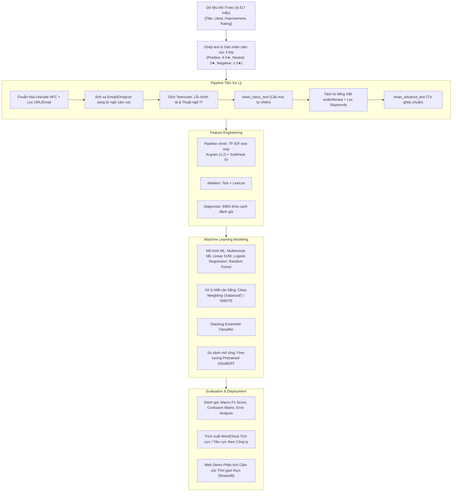

# Đồ Án Môn Học Máy Học: Phân Tích Cảm Xúc (Sentiment Analysis) Đánh Giá ITviec

## 1. Giới thiệu Đề tài
Dự án tập trung giải quyết bài toán **Phân loại Cảm xúc (Sentiment Classification)** từ dữ liệu văn bản đánh giá của nhân viên và ứng viên trên nền tảng **ITviec** bằng các phương pháp **Học Máy (Machine Learning)** và Trích xuất đặc trưng văn bản.

### Mục tiêu chính:
1. **Hiểu và phân tích dữ liệu (EDA):** Khám phá phân bố rating, độ dài đánh giá, mức độ mất cân bằng lớp và mối tương quan giữa các điểm thành phần.
2. **Tiền xử lý và trích xuất đặc trưng (Feature Extraction):** Chuẩn hóa văn bản tiếng Việt, tách từ ghép, xử lý teencode/emoji và chuyển đổi sang ma trận vector đặc trưng số **TF-IDF (N-gram 1-2)**.
3. **Huấn luyện và so sánh các mô hình Machine Learning:** Cài đặt, tinh chỉnh siêu tham số và so sánh hiệu năng của ít nhất 5 thuật toán: **Multinomial Naive Bayes, Logistic Regression, Support Vector Machine (Linear SVM), Random Forest Classifier, Stacking Ensemble Classifier** (kèm mở rộng đối sánh với mô hình Deep Learning ViSoBERT).
4. **Đánh giá và phân tích lỗi (Evaluation & Error Analysis):** Sử dụng Stratified 5-Fold Cross Validation và tập Test độc lập; đánh giá qua Macro F1-Score, Confusion Matrix, phân tích Overfitting/Underfitting và nguyên nhân nhầm lẫn.
5. **Khai phá Insight & Ứng dụng Demo:** Trích xuất từ khóa tích cực/tiêu cực theo từng công ty công nghệ và xây dựng giao diện dự đoán thời gian thực (Streamlit/Gradio).

---

## 2. Ý Tưởng & Phương Pháp Giải Quyết Bài Toán (Problem Formulation & Solution Approach)

### 2.1. Bản chất Bài toán & Xử lý Ghép Văn bản (Text Aggregation)
- **Bản chất dữ liệu:** Dữ liệu gốc thu thập từ ITviec gồm 8,417 đánh giá thực tế của nhân viên và ứng viên. Mỗi đánh giá được chia thành 3 phần độc lập: `Title` (Tiêu đề), `What I liked` (Điểm thích/Khen ngợi) và `Suggestions for improvement` (Đề xuất cải thiện/Góp ý/Chê).
- **Ý tưởng ghép trường văn bản:** Để mô hình có góc nhìn toàn diện về toàn bộ ý kiến đánh giá, ta tiến hành nối 3 trường này lại thành chuỗi văn bản hợp nhất:
```text
raw_review_text = Title + " . " + What I liked + " . " + Suggestions for improvement
```

### 2.2. Chiến lược Gán nhãn yếu từ Rating (Rating-derived Weak Labels)
Để xây dựng bộ dữ liệu huấn luyện ban đầu, dự án dùng điểm đánh giá **`Rating` (từ 1 đến 5 sao)** do người viết review chấm để tạo nhãn yếu (*weak labels / distant supervision*). Nhãn này là đại diện gần đúng cho cảm xúc tổng thể, không phải ground truth được con người kiểm định trực tiếp từ nội dung văn bản:

| Số sao (`Rating`) | Nhãn Cảm xúc (`Sentiment`) | Ý nghĩa nghiệp vụ | Số lượng mẫu | Tỷ lệ (%) |
| :---: | :---: | :--- | :---: | :---: |
| ⭐⭐⭐⭐⭐ (5 sao)<br>⭐⭐⭐⭐ (4 sao) | **`Positive`** *(Tích cực)* | Đánh giá thể hiện sự hài lòng cao về môi trường, chế độ đãi ngộ, văn hóa làm việc và ban lãnh đạo. | 6,208 | 73.76% |
| ⭐⭐⭐ (3 sao) | **`Neutral`** *(Trung tính)* | Đánh giá ở mức trung hòa, cân bằng; nội dung thường có cả điểm khen lẫn điểm chê tương đương nhau. | 1,639 | 19.47% |
| ⭐⭐ (2 sao)<br>⭐ (1 sao) | **`Negative`** *(Tiêu cực)* | Đánh giá thể hiện sự thất vọng, bức xúc về chính sách OT, quản lý yếu kém, môi trường độc hại hoặc chế độ đãi ngộ không thỏa đáng. | 570 | 6.77% |

> **Audit tính nhất quán nhãn:** Lexicon, trường `Recommend?`, text trùng và một mẫu gán nhãn thủ công được dùng để phát hiện bất đồng với Rating.

### 2.3. Thách thức đặc thù của Dữ liệu ITviec & Chiến lược Tiền xử lý Đa cấp
- **Thách thức:** Review ngành công nghệ mang tính đặc thù rất cao:
  1. Chêm xen tiếng Anh dày đặc (*OT, layoff, micromanage, benefit, probation, onboard, deploy, dev, pm,...*).
  2. Nhiều từ viết tắt, tiếng lóng, teencode (*cty, mn, k, lm, cx, mk, vđ, dc,...*).
  3. Biểu tượng cảm xúc (Emoji / Emojicon) thể hiện thái độ mạnh mẽ (*:), :((, ^^, 😡, ❤️, 👍*).
  4. Hiện tượng mất cân bằng dữ liệu nghiêm trọng (Positive chiếm đến 73.76% trong khi Negative chỉ 6.77%).
- **Chiến lược làm sạch 2 tầng (Dual-tier Preprocessing):**
  - **Tầng 1 - `clean_basic_text`:** Chuẩn hóa Unicode NFC, xóa link/email, giải mã emoji thành từ ngữ cảm xúc (`:)` $\to$ `tích_cực`, `😡` $\to$ `tiêu_cực`), dịch teencode và thuật ngữ IT sang tiếng Việt chuẩn.
  - **Tầng 2 - `clean_advance_text`:** Tách từ ghép tiếng Việt (`underthesea.word_tokenize`) và lọc bỏ từ dừng vô nghĩa (nhưng bảo lưu các từ mang sắc thái phủ định như *không, chẳng, chưa*). **Tối ưu không gian vector từ vựng** $\to$ Dành riêng cho các mô hình Machine Learning (**SVM, Naive Bayes, Logistic Regression, Random Forest, Stacking**).

### 2.4. Sơ đồ Luồng Xử lý Tổng thể (End-to-End Pipeline)



### 2.5. Ý tưởng Trích xuất Đặc trưng, Cân bằng Dữ liệu & Đánh giá
1. **Pipeline ML chính là text-only:** TF-IDF N-gram (1, 2) giúp mô hình học được cụm từ ngữ cảnh (*"rất tốt", "quá tệ", "thiếu minh bạch"*) và khớp với ứng dụng thực tế.
2. **Xử lý Mất cân bằng lớp (Handling Class Imbalance):** Áp dụng trọng số lớp nghịch đảo `class_weight='balanced'` trong hàm mất mát của mô hình để phạt nặng hơn khi đoán sai lớp thiểu số (Negative và Neutral).
3. **Tiêu chí Đánh giá Khách quan:** Sử dụng **Macro F1-Score** (trung bình F1 của cả 3 lớp) làm độ đo quyết định chính thay vì Accuracy thông thường, phản ánh chính xác hiệu quả trên toàn bộ các lớp.

---

## 3. Phân chia Công việc Nhóm (Team Assignment)

| Thành viên | Phân công | Kế hoạch chi tiết |
| :--- | :--- | :--- |
| **👑 TV1: Hoàng Hôn** *(Trưởng nhóm)* | `Business, Data Processing & Report` | [Xem kế hoạch TV1](reports/member_plans/TV1_HoangHon_Business_DataProcessing.md) |
| **👨‍💻 TV2: Văn Duy** | `Feature Engineering & EDA` | [Xem kế hoạch TV2](reports/member_plans/TV2_VanDuy_FeatureEngineering_EDA.md) |
| **👨‍💻 TV3: Duy Khang** | `ML Modeling & Hyperparameter Tuning` | [Xem kế hoạch TV3](reports/member_plans/TV3_DuyKhang_Modeling_Tuning.md) |
| **👨‍💻 TV4: Thành Trung** | `Evaluation, Sentiment Insights & Deployment` | [Xem kế hoạch TV4](reports/member_plans/TV4_ThanhTrung_Evaluation_Deployment.md) |

* Toàn bộ kế hoạch tổng hợp: [reports/project_plan_and_work_assignment.md](reports/project_plan_and_work_assignment.md)

---

## 4. Cấu trúc thư mục (Project Structure)

```text
Do_An_May_Hoc_Sentiment_Analysis/
├── data/
│   ├── raw/                 # Dữ liệu gốc (Reviews.xlsx, Overview_Companies.xlsx, ...)
│   ├── processed/           # Dữ liệu sạch (reviews_cleaned.xlsx, reviews_cleaned.csv)
│   ├── dictionaries/        # Từ điển tiếng Việt (teencode, stopwords, emoji, lexicon)
│   └── annotation/          # Dữ liệu phục vụ kiểm định/audit chất lượng nhãn
├── notebooks/
│   ├── 01_data_exploration_eda.ipynb            # Khám phá & phân tích phân bố dữ liệu (EDA)
│   ├── 02_text_preprocessing.ipynb              # Tiền xử lý & chuẩn hóa tiếng Việt
│   ├── 03_sentiment_modeling_ml.ipynb           # Huấn luyện & tối ưu các mô hình Machine Learning
│   ├── 04_sentiment_modeling_deeplearning.ipynb # Mở rộng đối sánh ViSoBERT
│   └── 05_company_sentiment_insights.ipynb      # Phân tích cảm xúc theo công ty & WordCloud
├── src/
│   ├── __init__.py
│   ├── preprocessing.py     # Pipeline làm sạch văn bản, chuẩn hóa tiếng Việt
│   ├── features.py          # Trích xuất đặc trưng TF-IDF N-gram, SMOTE, chia tập
│   ├── models.py            # Huấn luyện, đánh giá & so sánh mô hình phân loại ML
│   └── utils.py             # Hàm tiện ích (vẽ WordCloud, đọc dữ liệu)
├── models/                  # Lưu trữ checkpoint và vectorizer (.joblib, manifest.json)
├── tests/                   # Bộ kiểm thử tự động (Unit Tests)
├── scripts/                 # Các script bổ trợ sinh mẫu và tiện ích
├── reports/
│   ├── figures/             # 9 biểu đồ EDA trực quan chất lượng cao (300 DPI)
│   ├── De_Cuong_Do_An_Mon_Hoc_May_Hoc.md # Đề cương chuẩn theo yêu cầu môn Máy học
│   ├── overview_for_team.md # Tài liệu tóm tắt logic dự án dễ hiểu cho cả nhóm
│   ├── eda_feature_engineering.md # Báo cáo chi tiết EDA & Trích xuất đặc trưng
│   ├── final_report_outline.md # Đề cương chi tiết báo cáo đồ án
│   ├── project_plan_and_work_assignment.md # Bảng phân công & timeline nhóm 4 người
│   └── member_plans/        # Kế hoạch hành động chi tiết của 4 thành viên
├── requirements.txt         # Danh sách thư viện Python cần thiết
├── requirements.lock        # Khóa phiên bản môi trường cố định
└── README.md                # Hướng dẫn tổng quan
```

---

## 5. Quy trình chạy thực nghiệm (Notebooks Workflow)

1. **Bước 1 — Tiền xử lý & Chuẩn hóa dữ liệu ([02_text_preprocessing.ipynb](notebooks/02_text_preprocessing.ipynb) / [scripts/run_step1_preprocessing.py](scripts/run_step1_preprocessing.py)):**
   - Tiền xử lý 2 tầng (`clean_basic_text` & `clean_advance_text`), chuẩn hóa Unicode, emoji/emoticon, teencode, thuật ngữ IT và lọc stopwords.
   - Gán nhãn cảm xúc 3 lớp và xuất `data/processed/reviews_cleaned.xlsx` (8.417 mẫu).
2. **Bước 2 — Khám phá dữ liệu (EDA) & Trích xuất TF-IDF ([01_data_exploration_eda.ipynb](notebooks/01_data_exploration_eda.ipynb)):**
   - Phân tích thống kê phân bố số sao rating, độ dài review, tương quan các khía cạnh, xuất 9 biểu đồ 300 DPI vào `reports/figures/`. Dữ liệu nguồn có 8.417 review; sau kiểm tra văn bản trùng, bộ dữ liệu mô hình hóa còn 8.414 review.
   - Trích xuất đặc trưng **TF-IDF N-gram (1, 2)** với `sublinear_tf=True`, `max_features=5000`, chia tập Stratified 80/20 và đóng gói artifacts vào `models/` (`train_test_features.joblib`, `artifact_manifest.json`).
3. **Bước 3 — Huấn luyện & Tối ưu Machine Learning ([03_sentiment_modeling_ml.ipynb](notebooks/03_sentiment_modeling_ml.ipynb)):**
   - Nạp ma trận đặc trưng từ `models/`, huấn luyện và tinh chỉnh 5 thuật toán Machine Learning (Naive Bayes, SVM, Logistic Regression, Random Forest, Stacking Ensemble) bằng Stratified 5-Fold Cross Validation trên tập Development.
   - Lưu checkpoint model tối ưu vào `models/best_sentiment_model.joblib`.
4. **Bước 4 — Mở rộng Deep Learning ([04_sentiment_modeling_deeplearning.ipynb](notebooks/04_sentiment_modeling_deeplearning.ipynb)):**
   - Thử nghiệm đối sánh mô hình Pretrained Transformer (ViSoBERT / PhoBERT) cho phân loại cảm xúc tiếng Việt.
5. **Bước 5 — Evaluation, Insight & Web Demo:**
   - [Notebook 06](notebooks/06_model_evaluation_error_analysis.ipynb) đọc snapshot Final Test đã khóa: Accuracy **73,74%**, Macro F1 **0,5714**, Weighted F1 **0,7489**; có Confusion Matrix và 15 mẫu Error Analysis.
   - [Notebook 05](notebooks/05_company_sentiment_insights.ipynb) phân tích 180 công ty, xuất WordCloud toàn tập và 5 case study có nhiều review nhất.
   - Web Demo Streamlit tại `app.py`: Overview, Company Insights, Benchmark, Evaluation và Real-time Prediction bằng Logistic Regression + TF-IDF 5.000 chiều.

---

## 6. Chạy Web Demo

```powershell
python -m venv .venv
.\.venv\Scripts\python.exe -m pip install -r requirements.lock
.\.venv\Scripts\python.exe -m streamlit run app.py
```

Mở `http://localhost:8501`. Lần đầu vào trang dự đoán có thể mất vài giây để khởi tạo tokenizer; các lần suy luận sau được cache tài nguyên.

### Bản sửa tiền xử lý đang dùng trong Web Demo

Khi kiểm tra câu ngắn, nhóm phát hiện stopword đã xóa `thấp`, `nhiều`, `thiếu`, `cao`, `ít`, `nhanh`; `OT` bị đổi thành cụm không còn token, và `quan tâm` bị chuẩn hóa sai. Bản sửa giữ các tín hiệu này, fit lại TF-IDF và train lại Logistic Regression + SMOTE trên **đúng chỉ số hàng Development/Final Test cũ**. Artifacts mới ở `models/retrained_v2/` và Web Demo nạp cặp model/vectorizer tại đây.

- Development 5-fold CV (fit lại TF-IDF trong từng fold cho cả hai bản): Macro F1 **0,5708 → 0,5815**.
- Đối chiếu trên Final Test đã sử dụng trước đó: Accuracy **73,74% → 74,33%**, Macro F1 **0,5714 → 0,5764**, Recall Negative **44,74% → 45,61%**.
- Snapshot và ma trận của bản sửa ở `reports/evaluation/retrained_v2/`; bản gốc được giữ nguyên tại `reports/evaluation/`.

Đây là **đánh giá lại trên cùng Final Test**, không phải một tập kiểm thử độc lập mới. Bảng xếp hạng năm thuật toán và slide hiện có vẫn mô tả lần thử ban đầu; khi thuyết trình bản sửa, dùng các con số ở [báo cáo bản sửa](reports/retrained_v2_evaluation.md). Có thể tái lập bằng `scripts/retrain_sentiment_after_preprocessing.py`, sau đó `scripts/evaluate_retrained_v2.py`.

Chạy kiểm thử:

```powershell
.\.venv\Scripts\python.exe -m pytest -q
```

> `scripts/run_tv4_evaluation.py` có cơ chế run-once và sẽ từ chối mở lại Final Test khi snapshot đã tồn tại.

---

## 7. Bảng Theo dõi Tiến độ Dự án (Project Progress & Deliverables)

*Cập nhật bản sửa tiền xử lý: 23/09/2026 — 37 tests pass | Web Demo dùng model huấn luyện lại | Final Test cũ được giữ để đối chiếu*

| STT | Hạng mục công việc | Phụ trách chính | Trạng thái | Chi tiết kế hoạch bàn giao |
| :---: | :--- | :--- | :---: | :--- |
| **1** | **Thiết lập dự án & Bộ từ điển** | **TV1: Hoàng Hôn** | ✅ **Hoàn thành** | Repo, `requirements.txt`, 10 bộ từ điển tại `data/dictionaries/` đã tối ưu và sẵn sàng. |
| **2** | **Pipeline Tiền xử lý & Gán nhãn** | **TV1: Hoàng Hôn** | ✅ **Hoàn thành** | `src/preprocessing.py`, `data/processed/reviews_cleaned.xlsx` & `.csv` (8.417 mẫu × 23 cột, 3 nhãn: Positive 73.8% / Neutral 19.5% / Negative 6.8%). |
| **3** | **Phân tích EDA & Trích xuất TF-IDF** | **TV2: Văn Duy** | ✅ **Hoàn thành** | Notebook `01_data_exploration_eda.ipynb` đã chạy đủ output; 9 biểu đồ 300 DPI tại `reports/figures/`; `src/features.py` + 11 test pass; Stratified 80/20 seed 2026 (development 6.731 / final test 1.683 khóa); artifacts `text_tfidf_vectorizer.joblib`, `text_feature_extractor.joblib`, `train_test_features.joblib`, `artifact_manifest.json` (có checksum + runtime). CV development: TF-IDF (1,2) Macro F1 **0,5722**. Báo cáo: `reports/eda_feature_engineering.md`. |
| **4** | **Huấn luyện Mô hình Machine Learning** | **TV3: Duy Khang** | ✅ **Hoàn thành** | `03_sentiment_modeling_ml.ipynb` + `src/models.py` (12 test pass): so sánh `class_weight='balanced'` vs SMOTE (SMOTE bọc trong Pipeline theo từng fold, chống leakage), GridSearchCV tune 5 thuật toán (Naive Bayes, Logistic Regression, Linear SVM, Random Forest, Stacking Ensemble `[MNB,LR,SVM,RF]→LR`) bằng Stratified 5-Fold CV trên Development set (`X_train`, không đụng Final Test). Model tốt nhất: **Logistic Regression** (`C=1.0`, SMOTE), CV Macro F1 **0,5727**, khóa tại `models/best_sentiment_model.joblib`. Báo cáo: [reports/modeling_hyperparameter_tuning.md](reports/modeling_hyperparameter_tuning.md). |
| **5** | **Đánh giá Final Test, Insight & Demo** | **TV4: Thành Trung** | ✅ **Hoàn thành** | Final Test run-once: Accuracy **73,74%**, Macro F1 **0,5714**; có per-class metrics, Confusion Matrix, 15 mẫu Error Analysis, 12 WordCloud, 5 company case study và Web Demo Streamlit. |
| **6** | **Tổng hợp Báo cáo Word & Slide trình chiếu** | **TV1 & Cả nhóm** | ⏳ **Giai đoạn cuối** | Slide PowerPoint 15 trang đã có tại `reports/slides/ITviec_Sentiment_Analysis.pptx`; báo cáo Word/PDF cần hoàn thiện theo đề cương `reports/De_Cuong_Do_An_Mon_Hoc_May_Hoc.md`. |


