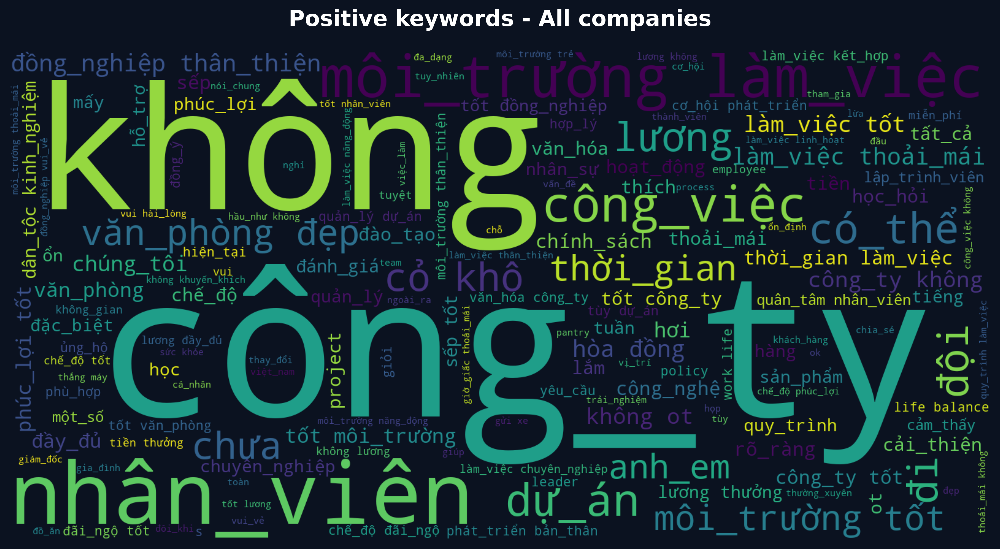
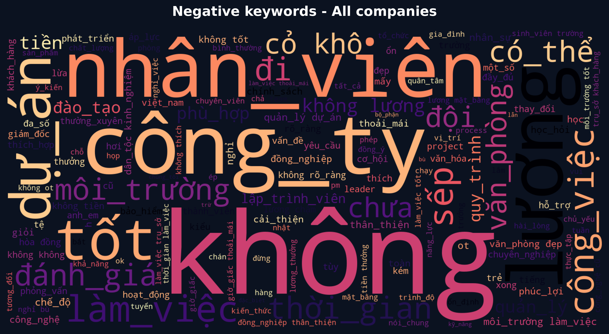

# TV4 - Company Sentiment Insights

Phân tích mô tả trên **8,417 reviews**, **180 công ty**. Năm case study được chọn theo số review lớn nhất để giảm rủi ro kết luận từ mẫu quá nhỏ.

## WordCloud toàn bộ dữ liệu

## Case study 5 công ty

### FPT Software (2014 reviews)

- Positive: **57.7%**; Neutral: **33.4%**; Negative: **8.9%**.
- Khía cạnh thấp nhất: **Salary & benefits**.
- Đề xuất: Rà soát lương, thưởng và phúc lợi theo benchmark thị trường.
### NashTech (308 reviews)

- Positive: **69.2%**; Neutral: **26.3%**; Negative: **4.5%**.
- Khía cạnh thấp nhất: **Salary & benefits**.
- Đề xuất: Rà soát lương, thưởng và phúc lợi theo benchmark thị trường.
### Bosch Global Software Technologies Company Limited (278 reviews)

- Positive: **39.6%**; Neutral: **45.0%**; Negative: **15.5%**.
- Khía cạnh thấp nhất: **Salary & benefits**.
- Đề xuất: Rà soát lương, thưởng và phúc lợi theo benchmark thị trường.
### VNG Corporation (259 reviews)

- Positive: **75.7%**; Neutral: **21.6%**; Negative: **2.7%**.
- Khía cạnh thấp nhất: **Management cares about me**.
- Đề xuất: Cải thiện 1:1, phản hồi hai chiều và năng lực quản lý con người.
### KMS Technology (251 reviews)

- Positive: **80.5%**; Neutral: **14.7%**; Negative: **4.8%**.
- Khía cạnh thấp nhất: **Salary & benefits**.
- Đề xuất: Rà soát lương, thưởng và phúc lợi theo benchmark thị trường.

## Giới hạn

- Nhãn sentiment là weak label suy ra từ rating, không phải nhãn cảm xúc được chuyên gia gán thủ công.
- WordCloud phản ánh tần suất từ, không chứng minh nguyên nhân hay mức độ quan trọng.
- Không dùng kết quả này như bảng xếp hạng chất lượng doanh nghiệp.
