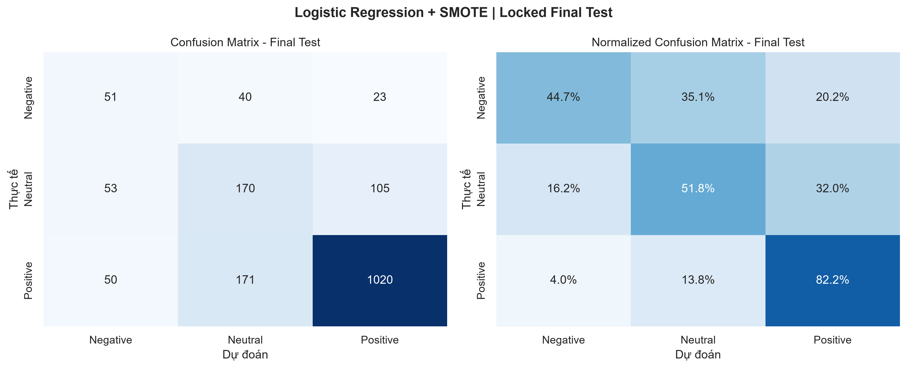

# TV4 - Đánh giá Final Test và phân tích lỗi

## 3.4. Kết quả thực nghiệm

Mô hình được TV3 khóa trước khi mở Final Test là **Logistic Regression (`C=1.0`) + SMOTE**. Final Test gồm **1,683** mẫu và chỉ được đánh giá trong lần chạy có snapshot này.

- Accuracy: **73.74%**
- Macro F1: **0.5714**
- Weighted F1: **0.7489**
- Số dự đoán sai: **442/1,683**
- Thời gian suy luận cả Final Test: **0.0310 giây**

### Chỉ số theo từng lớp

| Label | Precision | Recall | F1 | Support |
| --- | --- | --- | --- | --- |
| Negative | 0.3312 | 0.4474 | 0.3806 | 114 |
| Neutral | 0.4462 | 0.5183 | 0.4795 | 328 |
| Positive | 0.8885 | 0.8219 | 0.8539 | 1241 |

### Xếp hạng mô hình trên Development set

| Rank | Model | CV Macro F1 | Strategy | Best Params | Refit Time |
| --- | --- | --- | --- | --- | --- |
| 1 | Logistic Regression | 0.5727 | SMOTE | C=1.0 | 0.620 s |
| 2 | Linear SVM | 0.5724 | Balanced | C=0.1 | 0.072 s |
| 3 | Random Forest | 0.5664 | Balanced | max_depth=30, n_estimators=400 | 1.533 s |
| 4 | Stacking Ensemble | 0.5560 | Mixed | cv=5 | 19.924 s |
| 5 | Multinomial Naive Bayes | 0.5534 | SMOTE | alpha=0.5 | 0.172 s |

> Bảng xếp hạng dùng Stratified 5-Fold CV do TV3 bàn giao. Chỉ mô hình đã chọn được mở Final Test; không dùng Final Test để xếp hạng lại năm mô hình.

`Refit Time` là một lần fit cấu hình đã chọn trên toàn Development set tại máy local, không phải tổng thời gian GridSearchCV. Logistic Regression được chọn vì có Macro F1 cao nhất, chi phí refit thấp và có `predict_proba()` cho Web Demo.

## 3.5. Confusion Matrix và Error Analysis



Ma trận theo thứ tự `Negative, Neutral, Positive`:

```text
[[51, 40, 23], [53, 170, 105], [50, 171, 1020]]
```

- **Negative:** Recall 44.74%, cho thấy lớp thiểu số vẫn là lớp khó nhất.
- **Neutral:** Recall 51.83%; review trung tính dễ bị kéo sang Positive khi chứa nhiều từ khen.
- **Positive:** Recall 82.19%; kết quả cao một phần do lớp Positive chiếm đa số.

### Nhóm nguyên nhân trong 15 mẫu phân tích thủ công

| Nhóm nguyên nhân | Số mẫu |
| --- | --- |
| Mixed sentiment | 10 |
| Label noise | 4 |
| Multi-aspect long review | 1 |

Danh sách chi tiết ở `reports/evaluation/error_analysis_15_samples.csv`. Mười lăm mẫu đại diện đã được đọc thủ công và có cột `manual_category`, `manual_analysis`; 442 lỗi toàn tập vẫn giữ nhãn heuristic để hỗ trợ tra cứu.

## Overfitting / Underfitting

- Development CV Macro F1: **0.5727**
- Final Test Macro F1: **0.5714**
- Chênh lệch Final Test - CV: **-0.0014**

Chênh lệch này nhỏ, chưa cho thấy dấu hiệu overfitting nghiêm trọng.

## Giới hạn diễn giải

- Nhãn được suy ra từ rating nên có nguy cơ label noise.
- TF-IDF không hiểu đầy đủ ngữ cảnh, mỉa mai và quan hệ phủ định dài.
- Accuracy không phải chỉ số chính do dữ liệu mất cân bằng; cần ưu tiên Macro F1 và chỉ số theo từng lớp.
